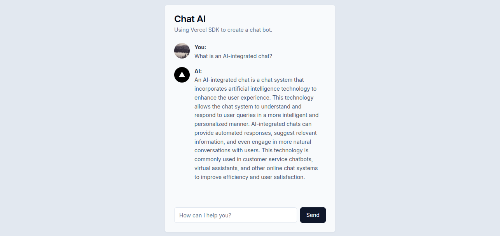

## Chat AI

[](https://nextjs.org/)
[](https://tailwindcss.com/)
[](https://ui.shadcn.com/docs/installation)
[](https://platform.openai.com/docs/overview)
[](https://sdk.vercel.ai/)

### summary

- [About](#about-the-project)
- [Api key](#api-key)
- [Install dependencies](#install-dependencies)
- [Run project](#run-project)

---

### About the project:
Next.js front-end project for consuming the OpenAI API, which is a chat application.

It is possible to customize the prompt to limit or specialize the context; an OpenAI API key is required.



### Api key
- You must generate an api key in [platform openai](https://platform.openai.com/api-keys)
and add it to the `.env` file under the `OPENAI_API_KEY` key

### Install dependencies
```bash
npm install
```

### Run project
```bash
npm run dev
```
